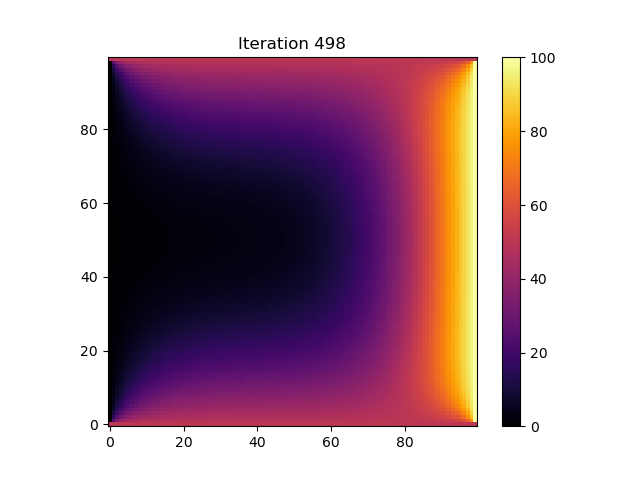
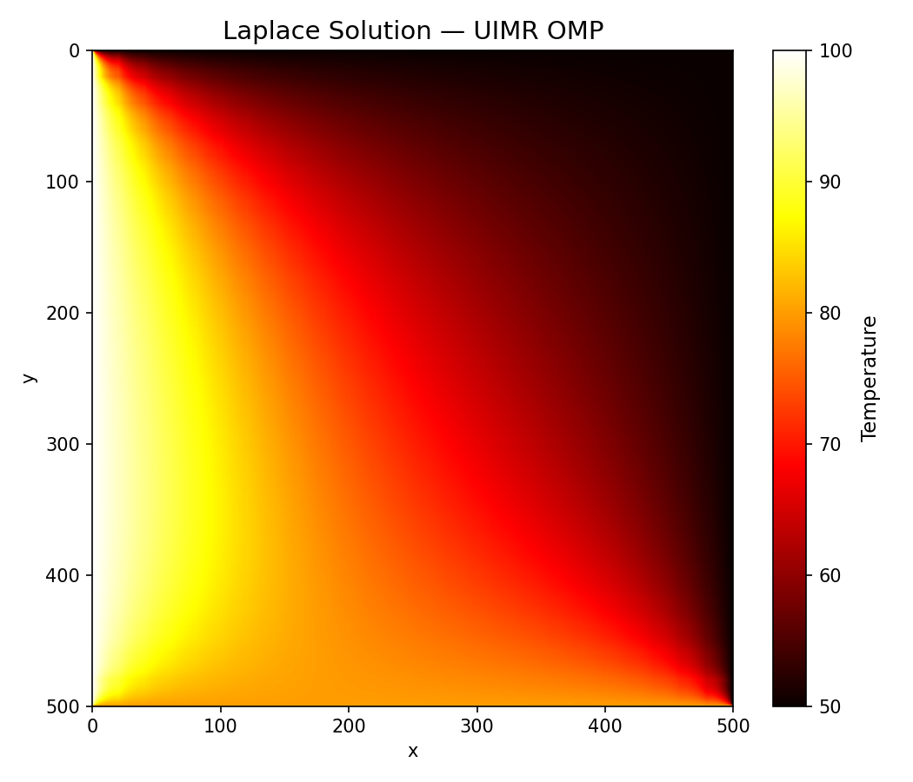

# Memory-Constrained Laplace Solver (UIMR Prototype)

I am working on **out-of-core / memory-constrained approaches** to differential equations, using the Laplace equation as a test case for now.

The primary goal of this project is **memory scalability**, not raw performance. Runtime performance is considered a secondary objective and is expected to improve with parallelisation.

---

## Motivation

Traditional numerical solvers for PDEs typically require holding the **entire computational grid in memory**. While this approach is efficient when memory is abundant, it becomes limiting for high-resolution problems or memory-constrained systems.

Target:
- solve PDEs **piecewise**
- keep only a **small fraction of the domain in memory**
- exchange information via **local boundary conditions**
- converge to the correct global solution with a **small working set**

---

## Approach: Unique / Local Mesh Refinement (UIMR)

The idea is conceptually similar to domain decomposition methods:

1. The global domain is split into smaller blocks (subdomains).
2. Each block is solved independently using local boundary conditions.
3. Only the **local boundary values** are retained between iterations.
4. The local boundaries are iteratively updated until convergence.
5. The full domain solution is recovered by stitching the block solutions.

At no point is the full global grid required to be resident in memory.

This prototype currently implements:
- a 2D Laplace solver
- Jacobi-style iteration within each block
- iterative exchange of local boundary conditions
- convergence based on boundary updates

---

## Comparison with In-Core Solver

To evaluate memory usage, the out-of-core implementation was compared with a traditional in-core Laplace solver using identical compiler optimisations (`-O3 -DNDEBUG -march=native`).

### In-Core Solver
- Faster runtime
- Larger resident memory footprint due to full-grid storage and aggressive OS buffering

These results demonstrate that the **out-of-core formulation achieves a substantially lower memory footprint**, which is the primary objective of this prototype.

---

## Current Status

Correctness validated against an in-core Laplace solver
Memory usage measured and characterised
Boundary handling and convergence logic implemented. Also optimised both the traditional solver and implemented a parallel version. The out-of-core version is around as fast as the in-core version and takes less memory as well.

---

## Planned Improvements

Replace file-based boundary exchange with in-memory arrays
Parallelise block solves (OpenMP / task-based parallelism)
Extend to higher resolutions and dimensions
Explore acceleration via surrogate models (e.g. ML-based boundary prediction)
Investigate GPU acceleration for block solves

---

## Disclaimer

This code is a **research prototype** intended for learning and exploration.  
It is not optimised, production-ready, or numerically sophisticated compared to established PDE solvers.

---

## Author

**Aayush Randeep**  
BS–MS Physics, IISER Bhopal  
Email: aayush21@iiserb.ac.in

